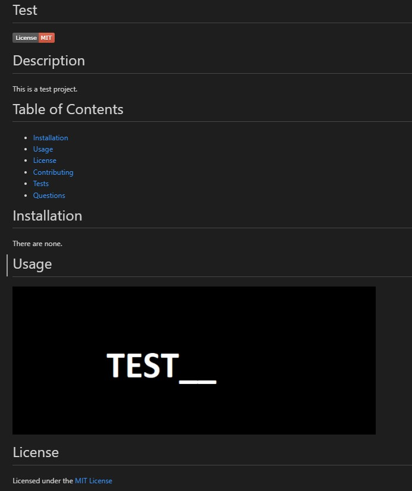

# HW09-Nodejs-Readme-Generator

Node.js: Readme Generator 

This is a repository that contains code for generating a Markdown Readme file.

This requires the use of node.js to run the code in an text editor such as Visual Studio Code.

Other than installing Node.js, you must install the inquirer package by using NPM via Node.js.

When running the index.js file in the terminal using node.js, you will be given a series of questions to answer by either typing in text or selecting an option using arrow keys.

After all questions are answered a markdown readme file will be generated which you can use for your GitHub repository.

This is only an example, a screenshot of a generated readme file (it is not showing the whole page): 
